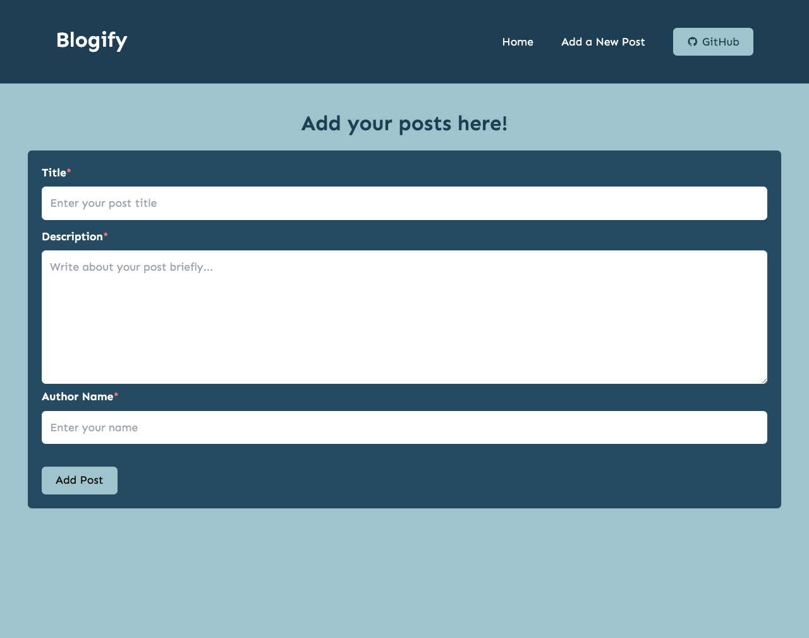
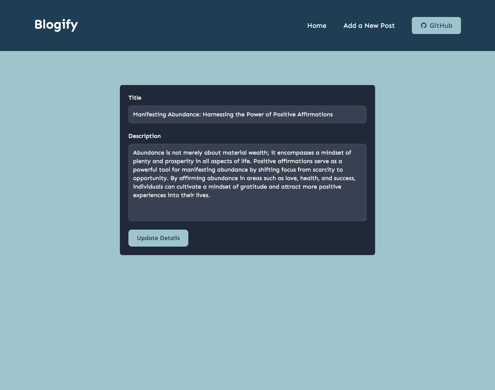
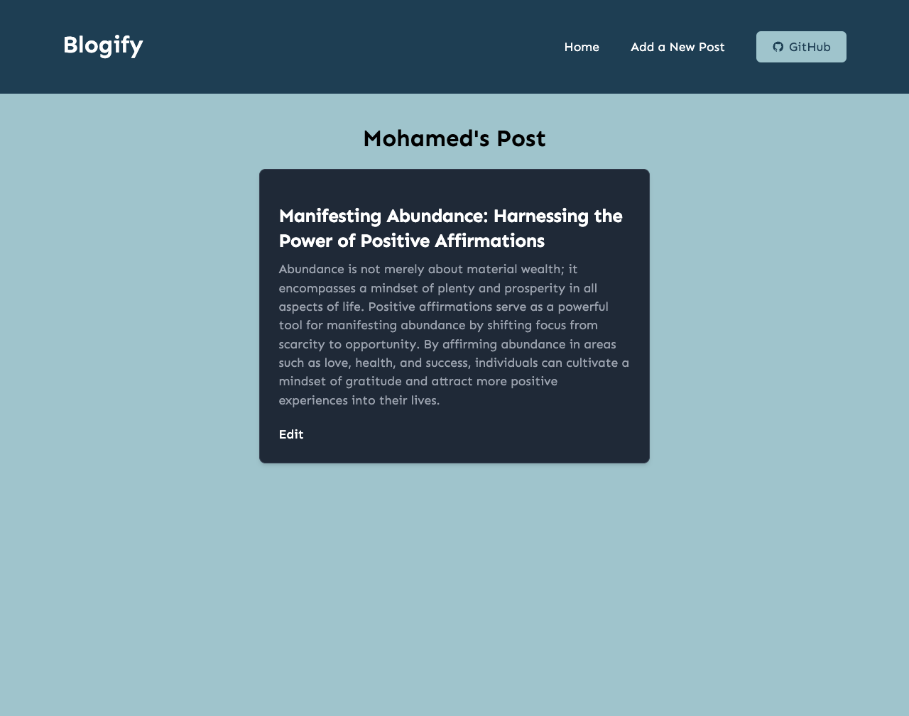

# Blogify

Create a Blog Post

## Table of Contents

- [Blogify](#project-title)
- [Description](#description)
- [Live Link](#live)
- [Screenshot](#demo)
- [Internship](#internship)
- [Technologies Used](#technologies-used)
- [Features](#features)
- [Installation](#installation)
- [Usage](#usage)
- [Contributing](#contributing)
- [License](#license)
- [Acknowledgments](#acknowledgments)

## Description

Discover the convergence of modern web technologies in our latest blog post! Using HTML, Tailwind CSS, and ReactJS for frontend development, and Firebase for backend infrastructure, our comprehensive guide explores innovative applications and transformative potentials. From dynamic user interfaces to seamless data management, delve into the power of these technologies reshaping digital experiences across industries.

## Live Link:

https://blogify-app-ishb-git-main-mushkirs-projects.vercel.app/

## Screenshot

Home Page

Add Post

Edit Post

View Post

[Include links to a live demo, screenshots, or GIFs that showcase your project in action.]

## Internship

This internship is provided by [CyberDude Networks Pvt. Ltd.](https://youtube.com/cyberdudenetworks) as part of the 6-Month Free Internship program, a skill development initiative organized to enhance participants' skills. Mentoring was provided by [Mr. Anbuselvan Rocky](https://instagram.com/anbuselvanrocky). For more information, [you can contact CyberDude Networks here](https://cyberdudenetworks.com).

## Technologies Used

### 1. HTML

- HTML (Hypertext Markup Language) is the standard markup language for creating web pages and web applications.
- It provides the structure and content of web pages.

### 2. Tailwind CSS

- Tailwind CSS is a utility-first CSS framework for rapidly building custom user interfaces.
- It provides low-level utility classes that can be composed to create custom designs without needing to write custom CSS.

### 3. React JS

- React JS is a JavaScript library for building user interfaces.
- It allows developers to create reusable UI components and manage the state of web applications efficiently.

### 4. Firebase

- Firebase is a platform developed by Google for creating mobile and web applications.
- It provides a variety of services including real-time database, authentication, hosting, and cloud functions.

## Features

- **CRUD Operations:** This project allows for Create, Read, Update, and Delete operations for blog posts, enabling dynamic interaction with the content.

## Usage

To use this project effectively, follow these steps:

1. **Installation**:

   - Clone the repository to your local machine using Git.
   - Install the necessary dependencies by running `npm install` or `yarn install`.

2. **Development Mode**:
   - Start the development server by running `npm start` or `yarn start`.
   - This will launch the project in your default web browser and automatically reload the page whenever changes are made.

## Contributing

Based on this project, it is MIT license. You can contribute through the follwoing link:

GitHub Repo: https://github.com/Mushkir/blogify-app

## License

[--MIT]

## Acknowledgments

[Dinesh](https://github.com/dineshdevelope)
[Esakki](https://github.com/esakki2104prsnl)
